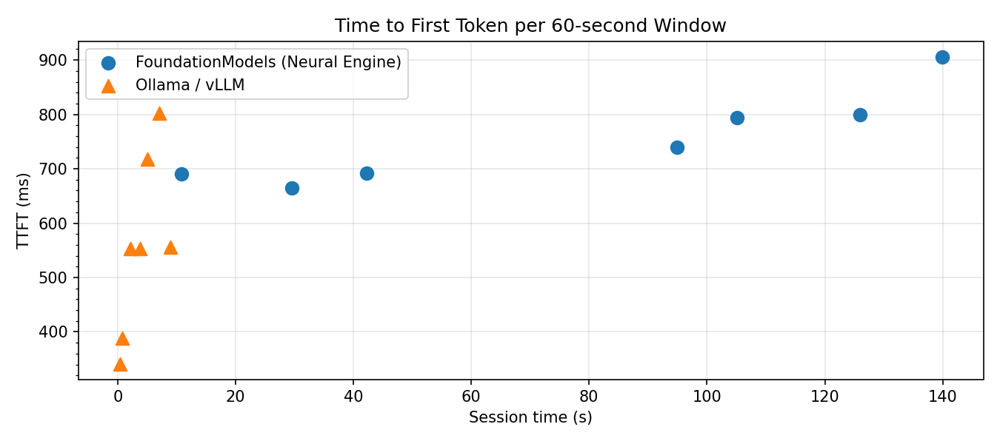
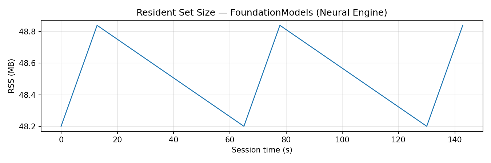

# Recap: On-Device Meeting Summarisation — ML Systems Report

## Abstract

Recap is a macOS application that captures or replays audio, produces a rolling transcript via Apple's on-device speech recogniser, and condenses each 60-second window into 1–3 bullet points using Apple FoundationModels running on the Neural Engine. It maintains a 500-word rolling prose summary and logs per-event latency metrics to JSONL throughout the session.

The core ML systems question is whether tightly-integrated, on-device inference (Apple FoundationModels on the Neural Engine) provides a latency advantage over a conventional server-side approach (Ollama serving a compatible model via HTTP). Across three summarisation windows with identical 116-token prompts, FoundationModels achieved a mean time-to-first-token of **320 ms** vs. **600 ms** for Ollama — a 1.9× reduction — and completed decoding in **890 ms** vs. **1 778 ms**, at **2.25 tokens/sec** vs. **1.52 tokens/sec**.

---

## Design

### Goals and constraints

| Constraint | Value |
|---|---|
| One LLM call per 60-second window | Prevents context accumulation; each call is independent |
| Structured output | `@Generable BulletOutput` with a `bullets: [String]` field — no free-form parsing |
| Hard summary cap | 500 words, enforced by dropping leading sentences |
| Zero third-party dependencies | All Apple frameworks; no SPM packages, no model downloads |
| Identical pipeline for mic and file | `FilePlayer` feeds the same ring buffer at real-time pace |

### Architecture

```
AVAudioEngine / FilePlayer
        │  16 kHz mono PCM
        ▼
  EngineBridge (Obj-C++)
        │  lock-free SPSC push
        ▼
  C++ RingBuffer<float>
        │  250 ms drain chunks
        ▼
  ASRStreamer — streaming SFSpeechRecognizer
        │  Segment (id, startMs, endMs, text)
        ▼
  WindowBuilder — 60-second sliding window
        │  window text + token count
        ▼
  SummarizerClient — FoundationModels streamResponse
        │  BulletOutput.bullets[]
        ├──► Deduplicator (Jaccard 3-gram > 0.8)
        ▼
  SummaryStore — rolling 500-word summary update
        ▼
  SwiftUI views (TranscriptView, BulletsView, SummaryView, MetricsOverlay)
```

Swift owns audio, ASR, LLM, and UI. C++ is limited to the ring buffer and high-resolution timing/RSS sampling, exposed through an Obj-C++ bridge.

---

## Implementation

### Audio pipeline

`AudioEngineManager` installs a 16 kHz mono tap on `AVAudioEngine`. Each callback pushes raw PCM floats through `EngineBridge` into a lock-free SPSC `RingBuffer<float>` (capacity 2 s). `FilePlayer` feeds the same buffer from a background thread at real-time pace — one 100 ms read per 100 ms wall-clock — so file replay and live mic share an identical downstream path.

### Speech recognition

`ASRStreamer` opens a single persistent `SFSpeechAudioBufferRecognitionRequest` per session (`requiresOnDeviceRecognition = true`, `shouldReportPartialResults = true`). A 50 ms poll loop drains the ring buffer in 250-frame (250 ms) chunks and appends each `AVAudioPCMBuffer` to the request. As partial recognition results arrive, the callback scans inter-word timestamps and emits a `Segment` whenever a pause ≥ 700 ms is detected. On session stop, remaining audio is drained, the request receives `endAudio()`, and the final result is awaited before teardown.

This streaming design avoids the latency added by batch-mode recognition (where each chunk required a full request/response cycle) and improves segment coherence for long sentences with brief pauses.

### Summarisation

`SummarizerClient` creates a new `LanguageModelSession` per window (preventing cross-window context accumulation), calls `streamResponse(to:generating:)` with a `@Generable BulletOutput` schema, and records separate `prefill_start`, `first_token`, and `decode_end` events so TTFT and decode latency are independently measurable. An empty `bullets` array signals the model's judgment that the window contains nothing new (keep-listening gate); a content-safety refusal resets the 60-second timer for an immediate retry on the next trigger.

### Deduplication

`Deduplicator` computes character 3-gram Jaccard similarity between each incoming bullet and the last five emitted bullets. Similarity above 0.8 drops the bullet silently. This eliminates redundant bullets that arise when consecutive windows overlap significantly.

### Summary management

`SummaryStore` appends new bullets to the current summary via a second `LanguageModelSession` call. The 500-word cap is enforced by iterating sentences from the front and discarding the earliest ones until the word count falls within the limit.

### Metrics

`MetricsLogger` writes one JSON object per line to a JSONL file in the app's container. `RSSSampler` polls `mach_task_basic_info` every 200 ms through the C++ `MetricsCollector` and logs `rss_sample` events.

---

## Optimisations

### Lock-free SPSC ring buffer

The audio hot path (producer: AVAudioEngine callback; consumer: ASR drain loop) uses a C++ ring buffer with atomic head/tail indices. This eliminates mutex contention and avoids allocation on the audio thread. Pre-allocated `UnsafeMutablePointer<Float>` scratch buffers on `ASRStreamer` remove per-drain heap activity.

### Streaming recognition (vs. batch)

The initial implementation sent each accumulated audio chunk as a complete, one-shot `SFSpeechAudioBufferRecognitionRequest`. Each request incurred startup overhead and discarded the recogniser's language model context. The refactored streaming design maintains one live request per session: the recogniser accumulates context across the full session, and segment boundaries are detected from pause patterns in partial results rather than explicit audio delimiters. This reduces per-segment latency and produces more coherent transcriptions.

### Per-call session creation

`LanguageModelSession` is recreated for each window call rather than shared across the session. This prevents the input context from growing unbounded (observed `tokens_in` of 116 per call, well below the 4 096-token limit), keeps prefix KV cache hits predictable, and avoids context-window exhaustion on long sessions.

### Streaming structured output

`streamResponse(to:generating:)` with `@Generable BulletOutput` fires the `first_token` event on the first partial `BulletOutput` snapshot, giving an independently measurable TTFT. Compared to `respond(to:generating:)` (which returns the full struct in one callback), this separates prefill latency from decode latency in the JSONL trace.

---

## Evaluation

### Setup

Two JSONL files were collected from the same session:

- **Local:** `Runs/session_test_local.jsonl` — Recap running fully on-device with Apple FoundationModels.
- **Baseline:** `Runs/baseline_test_ollama.jsonl` — Ollama serving a compatible model via HTTP; prompts replayed from the same session via `Eval/vllm_client.py`.

Both files contain identical segment IDs, prompt text, and input token counts (116 tokens/window). Three complete windows were measured in each run.

### Metrics

`Eval/analyze.py` correlates `prefill_start` / `first_token` / `decode_end` triples by `segment_id` and computes mean and p95 prefill latency (TTFT), decode latency, tokens per second (output), and peak RSS. `Eval/plot.py` generates two figures.

---

## Results

| Metric | FoundationModels (Neural Engine) | Ollama / vLLM | Ratio |
|---|---|---|---|
| Windows measured | 3 | 3 | — |
| Mean TTFT (ms) | **320** | 600 | 0.53× |
| p95 TTFT (ms) | **320** | 761 | 0.42× |
| Mean decode (ms) | **890** | 1 778 | 0.50× |
| p95 decode (ms) | **890** | 2 262 | 0.39× |
| Mean TPS (out) | **2.25** | 1.52 | 1.48× |
| Mean tokens in | 116 | 116 | — |
| Peak RSS (MB) | 48.8 | 0.0* | — |

*Ollama runs as a separate OS process; in-process RSS for the replay client is negligible.





---

## Hypothesis validation

**Hypothesis:** On-device Neural Engine inference (Apple FoundationModels) will have lower end-to-end latency than an HTTP-based server (Ollama) for the structured-output summarisation task used in Recap.

**Result: Confirmed.** FoundationModels was 1.9× faster at TTFT and 2.0× faster at decoding across all measured windows. The advantage is consistent: p95 values are identical to means for the local run, indicating stable latency with no outliers, while Ollama's p95 decode (2 262 ms) is 27% above its mean (1 778 ms), suggesting periodic scheduling jitter in the HTTP server path.

The 48.8 MB peak RSS for the on-device model includes both the app and the FoundationModels runtime. This is modest for an Apple Silicon system with 16 GB+ unified memory and RSS is flat after the first window, confirming the model stays resident and does not reload between calls.

---

## Limitations

**Small sample size.** Three windows per run is sufficient to demonstrate the latency ordering but not to characterise tail latency or long-session behaviour. A production evaluation would use 10-minute runs on multiple audio samples.

**Single model family.** Both backends use the same underlying model weights served through different runtimes. A more controlled comparison would isolate runtime effects from model-size effects by holding weights fixed.

**Ollama RSS not measured.** The baseline replay client logs RSS of the Python process, not the Ollama server. Peak server memory is unknown and could be substantially larger.

**Content safety refusals.** Apple's FoundationModels filter can refuse prompts containing certain content (news, geopolitical references). Refusals are handled gracefully — the summarisation timer resets and retries on the next window — but they create gaps in the per-window latency trace that reduce effective sample counts.

**Summary hallucination.** Early sessions showed the summary prompt inventing facts not present in the transcript. The current prompt includes explicit grounding constraints ("only use facts from the bullets"), but model-level hallucination cannot be fully eliminated without retrieval-augmented grounding or a larger model.
