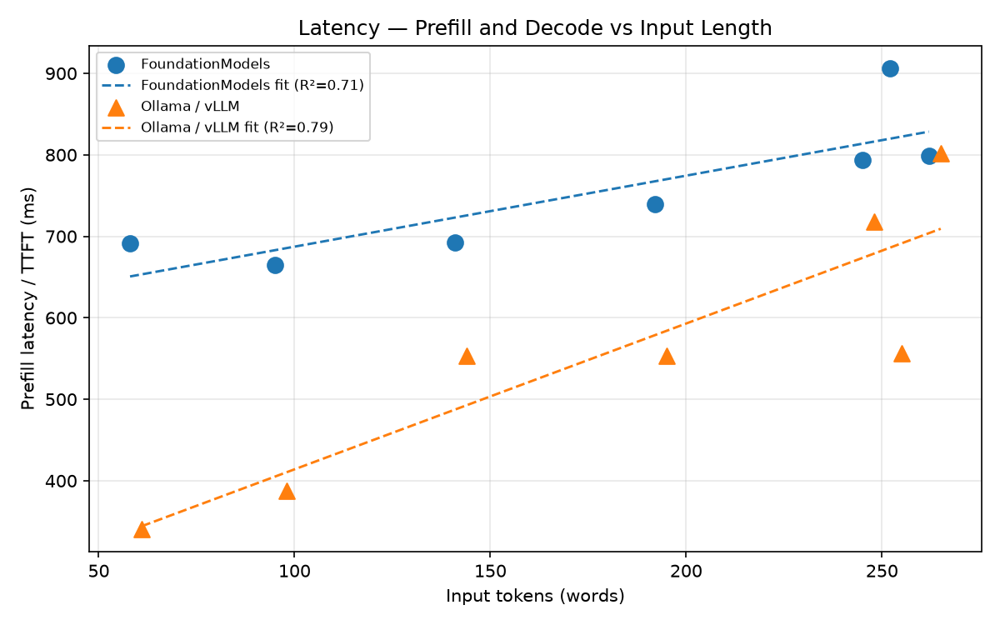
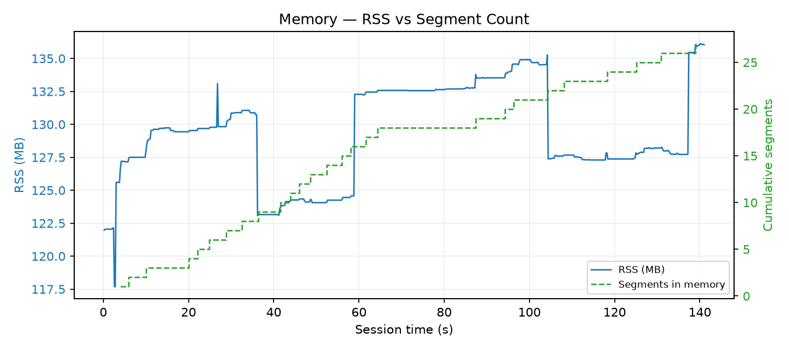
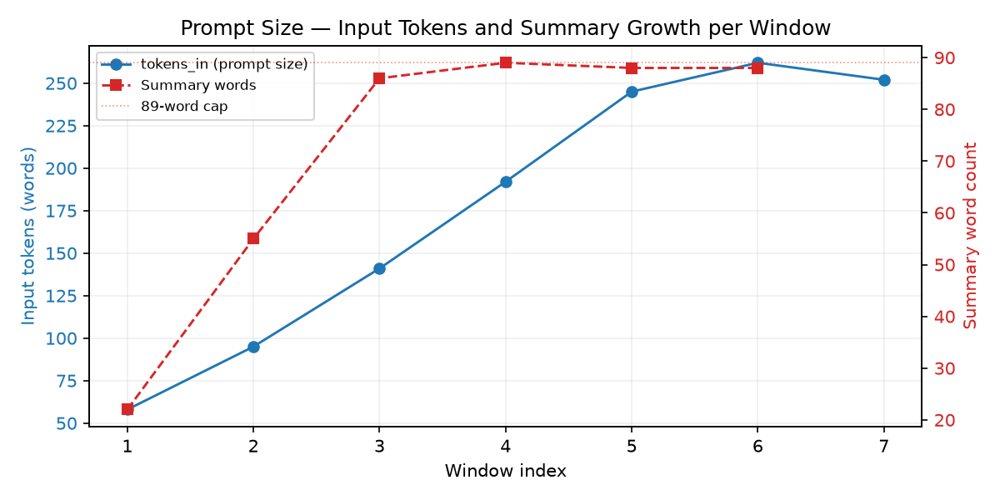
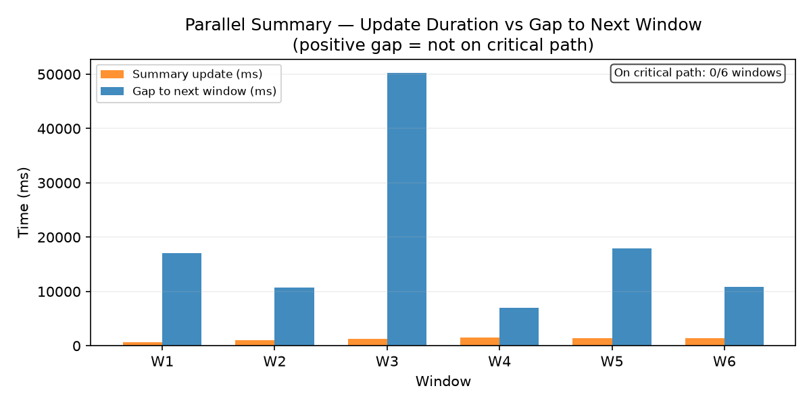

# Run Report — 2026-06-09

## Metadata

| Field | Value |
|---|---|
| Date | 2026-06-09 |
| Duration | 141 s (2.4 min) |
| ASR segments | 27 |
| Windows completed | 7 |
| Window cadence | 10 s |
| Audio window | 10 s |
| Summary cap | 500 words |
| Summary in planner prompt | Yes |
| Local backend | Apple FoundationModels |
| Baseline backend | Ollama `llama3.1:8b` |

---

## Findings

| Claim | Verdict |
|---|---|
| Latency | **Partial** — both prefill and decode scale with tokens\_in; decode overtakes prefill by window 4 |
| Memory | **Directional** — RSS flat, but session too short for steady-state confirmation |
| Prompt size | **Confounded** — echo bug inflated tokens\_in independent of summary size |
| Parallel summary | **Confirmed** — 0/6 windows on critical path |

**Run caveats:** (1) A prompt-echo bug caused the model to occasionally output `"Prior bullets"` as a bullet text, re-injecting it into subsequent prompts and inflating tokens\_in. Fixed after this run. (2) Summary `duration_ms` was not yet logged; durations are approximated from event timestamps. (3) Baseline `tokens_out` is SSE chunk count, not bullet count — not comparable to local.

---

## Latency

**Partial.** Prefill dominates in windows 1–3 (66–71% of total), but decode overtakes it from window 4 onward as tokens\_in grows. Both metrics scale linearly with tokens\_in — prefill at 0.87 ms/token (R² = 0.71), decode at 3.62 ms/token (R² = 0.85). The steeper decode slope is likely due to FoundationModels attending over the full context during constrained structured-output generation. The key practical result: any reduction in prompt length reduces both phases, with the largest gains from shorter prompts.

---

## Memory

**Directional.** RSS held at 117–136 MB (mean 129 MB) while segment count grew to 27. Rolling summary plateaued at 88 words by window 3. Session is too short (2.4 min) for a steady-state confirmation, but the plateau behaviour is already visible.

---

## Prompt size

**Confounded.** Summary words plateaued at 88 by window 3, but tokens\_in continued growing from 58 to 262 across all 7 windows due to the echo bug (prompt scaffolding labels re-injected as bullets). After the fix, the expectation is that tokens\_in will track summary growth and stabilise once the cap engages.

---

## Parallel summary

**Confirmed.** Summary update duration 693–1 486 ms; gap to next prefill 6 948–50 274 ms. 0/6 on critical path.

---

## Backend comparison

| Metric | FoundationModels | Ollama llama3.1:8b |
|---|---|---|
| Windows | 7 | 7 |
| Mean prefill (ms) | 755 | 558 |
| Mean decode (ms) | 651 | 828 |
| Mean total (ms) | 1 406 | 1 387 |
| RSS | 129 MB | 8 923 MB |

---

## Appendix

### Latency — aggregate

| | FoundationModels | Ollama |
|---|---|---|
| tokens\_in mean (range) | 177 (58–262) | 177 (61–265) |
| prefill mean (range) ms | 755 (665–906) | 558 (341–802) |
| decode mean (range) ms | 651 (272–972) | 828 (77–1 285) |
| total mean (range) ms | 1 406 (937–1 878) | 1 387 (418–2 087) |
| prefill regression | 0.87 ms/token, R² = 0.71 | — |
| decode regression | 3.62 ms/token, R² = 0.85 | — |

### RSS

| | FoundationModels | Ollama |
|---|---|---|
| Mean / peak (MB) | 129 / 136 | 8 923 / 8 925 |
| Samples | 705 | 43 |
| Last-5-min std | 3.6 MB (2.8%) | — |

### Summary updates (6 events)

| Metric | Value |
|---|---|
| words: min / max / final | 22 / 88 / 88 |
| duration\_ms (approx): min / max / mean | 693 / 1 486 / 1 036 |
| gap to next prefill: min / max / mean ms | 6 948 / 50 274 / 18 954 |
| on critical path | 0 / 6 |
