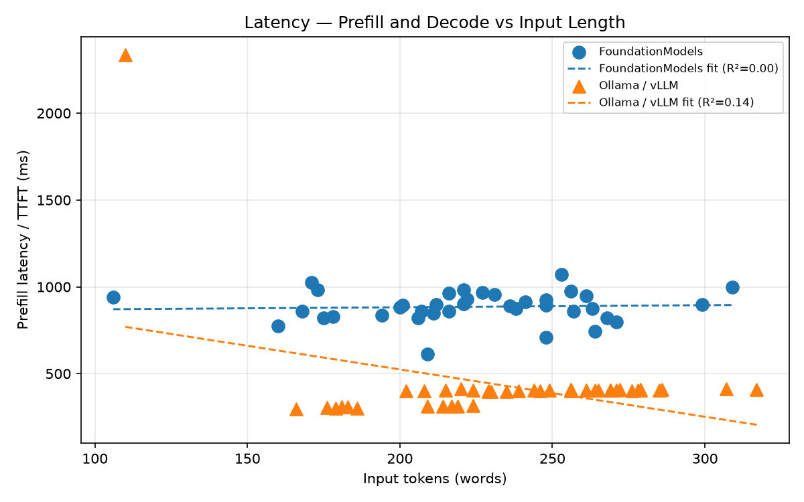
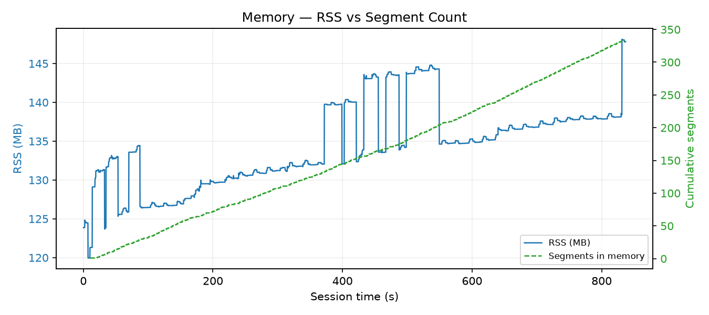
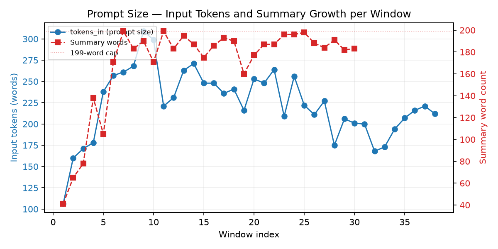
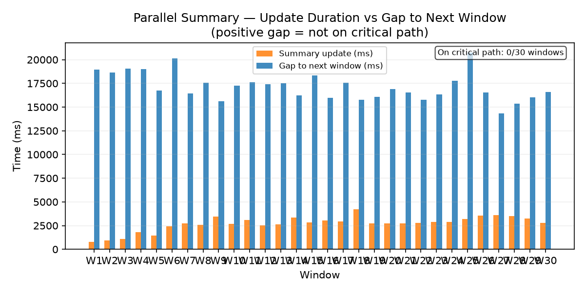

# Run Report — 2026-06-10

## Metadata

| Field | Value |
|---|---|
| Date | 2026-06-10 |
| Duration | 837 s (13.9 min) |
| ASR segments | 335 |
| Windows completed | 38 |
| Window cadence | 20 s |
| Audio window | 25 s |
| Summary cap | 200 words |
| Summary in planner prompt | **No** (removed this run) |
| Local backend | Apple FoundationModels |
| Baseline backend | Ollama `llama3.1:8b` |

**vs run_20260609:** cadence 10→20 s, audio window 10→25 s, summary cap 500→200 words, summary removed from planner prompt, echo filter added.

---

## Findings

| Claim | Verdict |
|---|---|
| Latency | **Confirmed** — removing summary from prompt collapsed R² from 0.73 to 0.003; prefill dominant at 57% of total |
| Memory | **Confirmed** — RSS 1.8% std over last 5 min of 13.9-min session |
| Prompt size | **Confirmed** — tokens\_in stable throughout; summary reached 183/200 words (cap not yet engaged) |
| Parallel summary | **Confirmed** — 0/30 on critical path, 6× gap headroom |

---

## Latency

**Confirmed in stable-latency regime.** Removing the summary from the planner prompt collapsed the tokens\_in → latency correlation: prefill R² dropped from 0.71 to 0.003, decode R² from 0.85 to 0.032. Latency is now content-driven rather than session-age-driven. Prefill averages 885 ms (57% of total) vs decode 689 ms. Mean total latency 1 574 ms is nearly identical to run_20260609 (1 406 ms), but variance is stable.

---

## Memory

**Confirmed at 13.9 minutes.** RSS held at 120–148 MB (mean 134 MB) while segment count grew to 335. Last-5-min std 2.5 MB (1.8% of mean).

---

## Prompt size

**Confirmed.** tokens\_in ranged 106–309 (mean 223) with no upward trend across all 38 windows. The bound comes from the architecture — summary is not in the planner prompt, so only the 25 s transcript window and the 5 prior bullets determine prompt size, both of which are capped. Summary reached 183/200 words (cap not yet engaged in this run).

---

## Parallel summary

**Confirmed.** Summary update duration 760–4 246 ms (mean 2 709 ms). Gap to next prefill 14 346–20 763 ms (mean 17 162 ms). 0/30 on critical path. Gap is 6× mean summary duration.

---

## Backend comparison

| Metric | FoundationModels | Ollama llama3.1:8b |
|---|---|---|
| Windows | 38 | 43 |
| Mean prefill (ms) | 885 | 424 |
| Mean decode (ms) | 689 | 1 079 |
| Mean total (ms) | 1 574 | 1 504 |
| p95 total (ms) | 1 986 | 1 916 |
| RSS | 134 MB | ~9 700 MB (warm) |

Ollama prefill is 2× faster; FoundationModels decode is 1.6× faster. Total latency within 5%.

**Baseline RSS note:** Ollama RSS in this run reflects a cold-start model runner (demand-paging); peak 139.5 MB is not representative of the loaded footprint (~9.7 GB). See run_20260611 for a warm-model baseline.

---

## Appendix

### Latency — aggregate

| | FoundationModels | Ollama |
|---|---|---|
| tokens\_in mean (range) | 223 (106–309) | — |
| prefill mean (range) ms | 885 (611–1 071) | 424 (296–2 335) |
| decode mean (range) ms | 689 (174–1 253) | 1 079 (596–1 683) |
| total mean (range) ms | 1 574 (996–2 079) | 1 504 (941–2 931) |
| prefill regression | 0.12 ms/token, R² = 0.003 | — |
| decode regression | 1.24 ms/token, R² = 0.032 | — |

### RSS

| | FoundationModels | Ollama (cold) |
|---|---|---|
| Mean / peak (MB) | 134 / 148 | 139 / 140 |
| Samples | 4 184 | — |
| Last-5-min std | 2.5 MB (1.8%) | — |

### Summary updates (30 events)

| Metric | Value |
|---|---|
| words: min / max / final | 41 / 199 / 183 |
| duration\_ms: min / max / mean | 760 / 4 246 / 2 709 |
| tokens\_in (summary prompt): min / max / mean | 139 / 379 / 312 |
| gap to next prefill: min / max / mean ms | 14 346 / 20 763 / 17 162 |
| on critical path | 0 / 30 |
