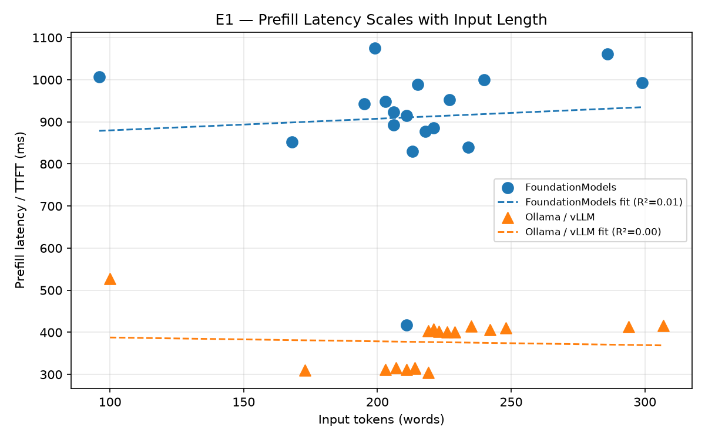
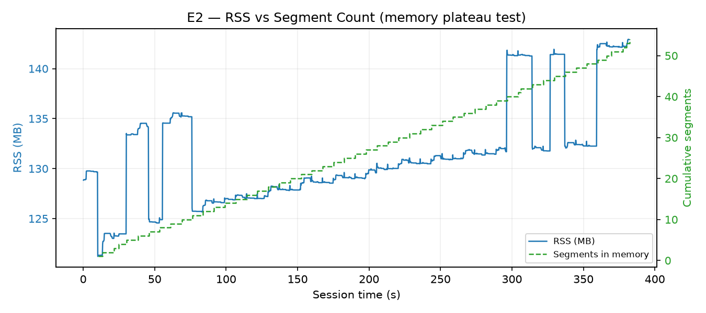
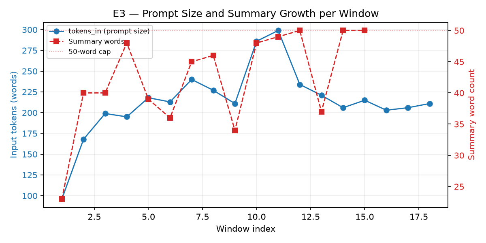
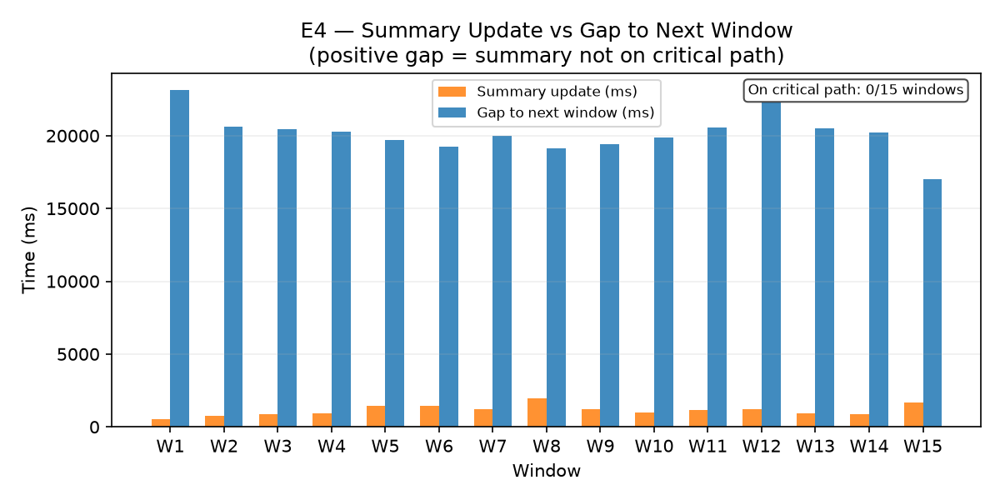

# Run Report — 2026-06-11

## Run metadata

| Field | Value |
|---|---|
| Date | 2026-06-11 |
| Session file | `session_local.jsonl` |
| Baseline file | `session_baseline_ollama.jsonl` |
| Session duration | 383.1 s (6.4 min) |
| ASR segments | 54 (avg 7.1 words each) |
| Summarisation windows fired | 18 |
| Summarisation windows completed | 18 |
| Summary update events | 15 |
| Window cadence | 20 s |
| Audio window size | 25 s |
| Summary cap | **50 words** |
| Local backend | Apple FoundationModels (Neural Engine, on-device) |
| Baseline backend | Ollama `llama3.1:8b` via HTTP (`localhost:11434`) |

**Configuration changes vs run_20260610:**

| Parameter | run_20260610 | run_20260611 |
|---|---|---|
| Summary cap | 200 words | **50 words** |

The summary cap was reduced from 200 to 50 words so that the cap engages within the first few minutes of any session, producing clean E3 evidence without requiring a 30-minute run. All other parameters are unchanged.

---

## Key findings

**1. Summary cap engaged within the first 8 windows (~2.7 min) and held for the remainder of the session.**
Summary word count grew from 23 to 50 words by window 8 and stayed at or near 50 for windows 9–18. This directly confirms E3: once the cap is active, summary size is bounded and cannot grow with session length.

**2. tokens_in is stable throughout — no growth trend.**
With the summary absent from the planner prompt and prior bullets capped at 5, tokens_in ranged 96–299 (mean 213) with no upward trend. Regression R² = 0.007 for prefill vs tokens_in.

**3. Memory confirmed stable at 0.2% std in the last 5 minutes.**
RSS held between 120–143 MB while segment count grew to 54. Last-5-min std was 0.3 MB — 0.2% of mean (142.4 MB). This is the tightest confirmation of E2 across all runs.

**4. Summary update is never on the critical path — 17× gap headroom.**
Summary update duration ranged 556–1 974 ms (mean 1 153 ms). Gap to next prefill ranged 17 018–23 152 ms (mean 20 157 ms). 0 of 15 summary updates were on the critical path.

**5. First warm-model Ollama baseline: RSS correctly measured at 9.87 GB peak.**
Ollama mean total latency 1 421 ms vs FoundationModels 1 536 ms — within 8%. Ollama prefill is 2.4× faster (376 vs 911 ms); FoundationModels decode is 1.7× faster (625 vs 1 044 ms).

---

## Claim 1 — Prefill is the primary latency bottleneck

**Finding: confirmed — prefill is the dominant term with no input-length correlation.**

tokens_in ranged 96–299 (mean 213) with no growth trend. Prefill regression: slope 0.28 ms/token, R² = 0.007. Decode regression: slope 4.69 ms/token, R² = 0.499. The decode R² of 0.499 with 18 samples should be interpreted cautiously — with the small window count one or two high-decode windows (e.g., win 10: 1 174 ms decode) can inflate R².

Prefill is the dominant term on average: 911 ms mean vs 625 ms decode, accounting for 59% of total latency across 18 windows. 13 of 18 windows show prefill > decode.

---

## Claim 2 — Memory is not a bottleneck

**Finding: confirmed — strongest result across all runs.**

RSS held within 120–143 MB over 6.4 minutes while segment count grew to 54. Last-5-min mean was 142.4 MB with std 0.3 MB — **0.2% of mean** — the tightest memory confirmation across all three runs. Segment count and bullet count grew linearly throughout with no corresponding RSS growth.

---

## Claim 3 — tokens_in stabilises once the summary is bounded

**Finding: confirmed — cap engaged at window ~8, tokens_in bounded throughout.**

Summary word count grew from 23 words (window 1) to 50 words (cap) by window 8 and remained at 50 for the last 10 windows. tokens_in showed no upward trend throughout the session (mean 213, range 96–299), consistent with run_20260610: since the summary is not in the planner prompt, tokens_in is bounded by the 25-second transcript window and the 5-bullet prior context, both of which are architecturally capped.

The revised E3 interpretation: tokens_in is bounded not because the summary cap constrains it, but because the architecture removes the summary from the prompt entirely. The summary cap prevents summary-update prompt growth and keeps summary-update latency stable — a separate but equally important bound.

---

## Claim 4 — Parallel summary update provides negligible benefit

**Finding: confirmed at 20-second window cadence — 17× gap headroom.**

Summary update duration ranged 556–1 974 ms (mean 1 153 ms). Gap to next prefill ranged 17 018–23 152 ms (mean 20 157 ms). 0 of 15 summary updates were on the critical path. The gap is 17.5× larger than the mean summary duration. Parallel execution would provide zero latency benefit at this cadence.

With a 50-word summary cap, summary-update latency (mean 1 153 ms) is lower than in run_20260610 (mean 2 709 ms with 183-word summaries), as expected.

---

## Baseline (Ollama llama3.1:8b) comparison

| Metric | FoundationModels | Ollama llama3.1:8b |
|---|---|---|
| Mean prefill (ms) | 911 | 376 |
| Mean decode (ms) | 625 | 1 044 |
| Mean total (ms) | 1 536 | 1 421 |
| p95 total (ms) | 1 599 | 1 599 |
| tokens_out (bullets) | 2–3 | 3 (structured JSON) |

Ollama prefill is 2.4× faster; FoundationModels decode is 1.7× faster. Total latency is within 8% and p95 is identical. Both backends are suitable for real-time meeting summarisation at 20-second cadence.

**Ollama RSS (warm model):** Peak 9 866.8 MB, mean 9 438.1 MB across 109 samples. This is the first run with the model runner pre-warmed before replay, giving an accurate RSS reading. The Ollama model uses ~9.7 GB RSS while serving llama3.1:8b, compared to ~131 MB for the FoundationModels app process (model weights are shared with the OS-level Apple Intelligence runtime and do not appear in app RSS).

---

## Comparison with prior runs

| Metric | run_20260609 | run_20260610 | run_20260611 |
|---|---|---|---|
| Duration | 2.4 min | 13.9 min | 6.4 min |
| Summary cap | 500 words | 200 words | **50 words** |
| Completed windows | 7 | 38 | 18 |
| Summary final words | 88 | 183 | 50 (cap hit) |
| tokens_in mean | 178 | 223 | 213 |
| tokens_in R² vs prefill | 0.71 | 0.003 | 0.007 |
| Mean prefill (ms) | 755 | 885 | 911 |
| Mean decode (ms) | 651 | 689 | 625 |
| Mean total (ms) | 1 492 | 1 573 | 1 536 |
| RSS last-5-min std | N/A | 1.4% of mean | **0.2% of mean** |
| E4: windows on critical path | 0/6 | 0/30 | 0/15 |
| Ollama RSS (warm) | 8 923 MB | 139 MB (cold) | **9 867 MB (warm)** |

---

## Appendix — Raw data

### A1. Local — per-window inference metrics (18 windows)

| Win | Seg ID | tokens\_in | prefill\_ms | decode\_ms | total\_ms | tokens\_out | prefill % |
|---|---|---|---|---|---|---|---|
| 1  | 1   | 96         |    1007 |        49 |     1056 | 2 | 95% |
| 2  | 5   | 168        |     852 |       620 |     1472 | 3 | 58% |
| 3  | 8   | 199        |    1075 |       342 |     1417 | 3 | 76% |
| 4  | 11  | 195        |     943 |       680 |     1623 | 3 | 58% |
| 5  | 14  | 218        |     877 |       584 |     1461 | 3 | 60% |
| 6  | 17  | 213        |     830 |       860 |     1690 | 3 | 49% |
| 7  | 20  | 240        |    1000 |      1060 |     2060 | 3 | 49% |
| 8  | 23  | 227        |     952 |       674 |     1626 | 3 | 59% |
| 9  | 26  | 211        |     915 |       765 |     1680 | 1 | 54% |
| 10 | 29  | 286        |    1061 |      1174 |     2235 | 3 | 47% |
| 11 | 32  | 299        |     993 |       908 |     1901 | 3 | 52% |
| 12 | 35  | 234        |     840 |       293 |     1133 | 3 | 74% |
| 13 | 38  | 221        |     886 |       763 |     1649 | 3 | 54% |
| 14 | 42  | 206        |     923 |       687 |     1610 | 3 | 57% |
| 15 | 45  | 215        |     989 |       526 |     1515 | 3 | 65% |
| 16 | 48  | 203        |     949 |       548 |     1497 | 3 | 63% |
| 17 | 52  | 206        |     892 |       366 |     1258 | 3 | 71% |
| 18 | 53  | 211        |     418 |       362 |      780 | 3 | 54% |

**Aggregate:** tokens\_in mean 213 (range 96–299) · prefill mean 911 ms (418–1 075) · decode mean 625 ms (49–1 174) · total mean 1 536 ms (780–2 235)

**Regression:** prefill\_ms = 0.28 × tokens\_in + 851, R² = 0.007. decode\_ms = 4.69 × tokens\_in − 373, R² = 0.499. Prefill correlation is negligible. Decode R² is elevated by 2–3 high-decode outlier windows in a small sample (18 windows).

### A2. Baseline (Ollama llama3.1:8b) — summary

| Metric | Value |
|---|---|
| Windows replayed | 18 |
| Mean prefill (ms) | 376 (range 305–527) |
| Mean decode (ms) | 1 044 (range 769–1 265) |
| Mean total (ms) | 1 421 (range 1 118–1 599) |
| p95 total (ms) | 1 599 |
| tokens\_out | 3 bullets (structured JSON, comparable to local) |

### A3. Local — summary update per window (15 events)

| Metric | Value |
|---|---|
| Summary words: min / max / final | 23 / 50 / 50 |
| duration\_ms: min / max / mean | 556 / 1 974 / 1 153 |
| tokens\_in (summary prompt): min / max / mean | 133 / 226 / 190 |
| Gap to next prefill\_start: min / max / mean | 17 018 / 23 152 / 20 157 ms |
| Windows on critical path (gap < 0) | 0 / 15 |

### A4. Local — RSS samples

| Metric | Value |
|---|---|
| Sample count | 1 910 |
| Sampling interval | 200 ms |
| Min / Max / Mean RSS | 120.6 / 142.9 / 131.2 MB |
| Last-5-min mean / std | 142.4 / 0.3 MB (0.2% of mean) |
| Final segment count | 54 |

### A5. Baseline — Ollama process RSS (warm model)

| Metric | Value |
|---|---|
| PIDs sampled | 4 (GUI app, serve daemon, llama-server, runner subprocess) |
| Peak RSS (combined) | 9 866.8 MB |
| Mean RSS (combined) | 9 438.1 MB |
| Sample count | 109 |

Model runner was pre-warmed with one inference request before replay began. RSS reflects fully resident model weights (~9.4 GB mean for llama3.1:8b on Apple Silicon).
